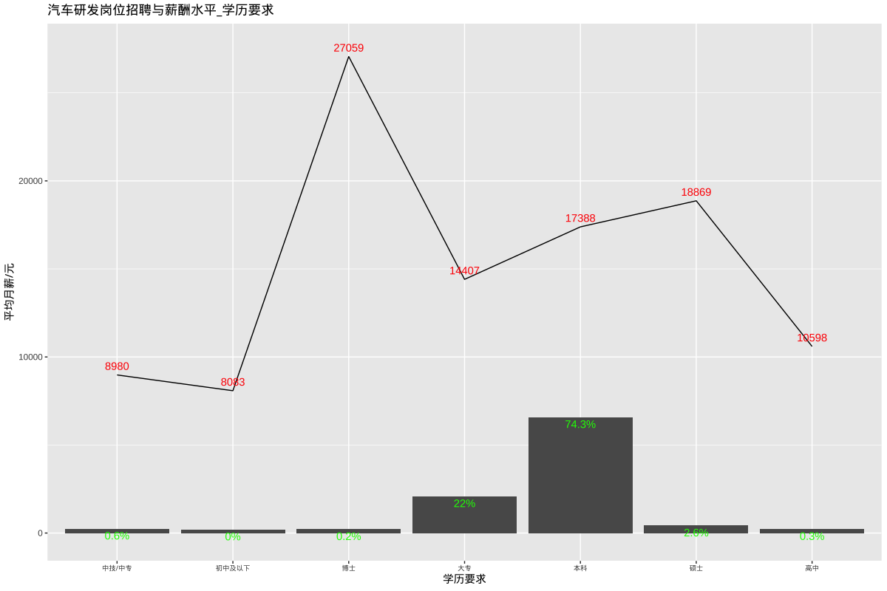

# 汽车研发招聘和薪酬水平

## 总述

本次采集有效数据8588条数据（城市发布量\>=100）,主要分析汽车研发相关岗位的招聘和薪酬水平，岗位如：项目经理、产品设计工程师、内外饰设计、车身设计、NVH、CAE、座椅开关、空调系统、制动系统、自动驾驶等。我们将从如下方面分析：

-   01.城市分布：主要在上海占28%，平均月薪18195元；其余城市均在9%或以下。

-   02.行业分布：汽车占81%，平均月薪16055元；新能源占12%，平均月薪22097元。

-   03.公司规模：1000人以下占60%，平均月薪16197元；1000-5000人占24%，平均月薪18221元。

-   04.公司类型：民企占42%，平均月薪17623元；外企占22%，平均月薪14863元。

-   05.工作经验：5年以下占68%，平均月薪15022元；5-10年占30%，平均月薪19788元。

-   06.学历要求：本科占74%，平均月薪17388元；大专占22%，平均月薪14407元。

## 01.城市分布

## 02.行业分布

## 03.公司规模

## 04.公司类型

## 05.工作经验

## 06.学历要求

